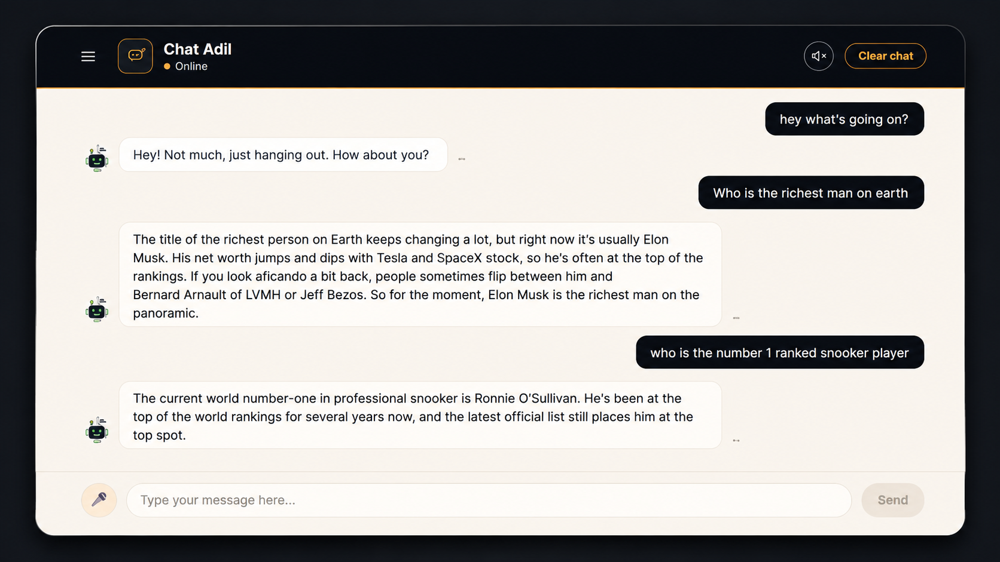

#  AI Chatbot

A modern AI-powered chatbot built with React that delivers intelligent conversational responses through the OpenRouter API. Designed with a clean interface, responsive layout, and smooth user experience with voice note feature.

##  Live Demo

🔗 https://adilchatapp.netlify.app/

---

##  Preview



---

##  Features

- AI-powered conversations
- Real-time responses
- Modern chat interface
- Responsive design
- Fast performance
- Loading indicators
- Error handling
- Clean UI/UX

---

##  Built With

- React
- JavaScript (ES6+)
- CSS3
- HTML5
- Vite
- OpenRouter API

---

## 📂 Project Structure

```text
ChatBot/
│
├── src/
├── assets/
├── index.html
├── package.json
├── vite.config.js
└── README.md
```

---

##  Responsive Design

Optimized for

- Desktop
- Laptop
- Tablet
- Mobile

---

##  Contact

If you'd like to collaborate, feel free to reach out.

- Email: adilishtiaq034mail.com

---

## 📄 License

This project is licensed under the MIT License.

---

### Developed & Designed by Adil Ishtiaq
